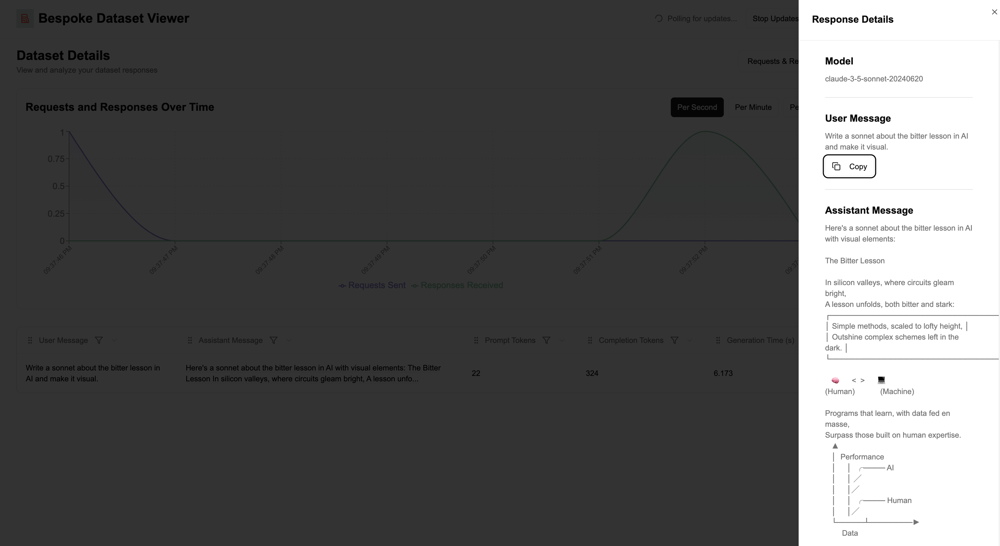
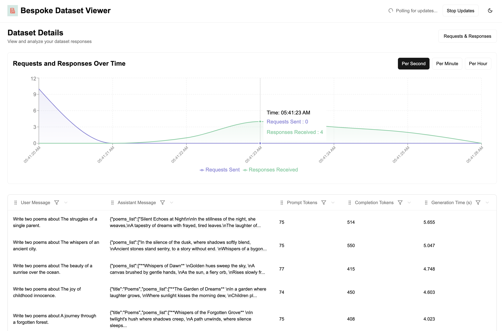

<p align="center">
  <a href="https://bespokelabs.ai/" target="_blank">
    <picture>
      <source media="(prefers-color-scheme: light)" width="80px" srcset="https://raw.githubusercontent.com/bespokelabsai/curator/main/docs/Bespoke-Labs-Logomark-Red.png">
      
    </picture>
  </a>
</p>

<h1 align="center">Bespoke Curator</h1>
<h3 align="center" style="font-size: 20px; margin-bottom: 4px">Data Curation for Post-Training & Structured Data Extraction</h3>
<br/>
<p align="center">
  <a href="https://docs.bespokelabs.ai/">
    
  </a>
  <a href="https://bespokelabs.ai/">
    
  </a>
  
  <a href="https://twitter.com/bespokelabsai">
    
  </a>
  <a href="https://discord.gg/KqpXvpzVBS">
    
  </a>
  <a href="https://github.com/psf/black">
    
  </a>
</p>

## Overview

Bespoke Curator makes it very easy to create high-quality synthetic data at scale, which you can use to finetune models or use for structured data extraction at scale.

Bespoke Curator is an open-source project:
* That comes with a rich Python based library for generating and curating synthetic data.
* A Curator Viewer which makes it easy to view the datasets, thus aiding in the dataset creation.
* We will also be releasing high-quality datasets that should move the needle on post-training.

## Key Features

1. **Programmability and Structured Outputs**: Synthetic data generation is lot more than just using a single prompt -- it involves calling LLMs multiple times and orchestrating control-flow. Curator treats structured outputs as first class citizens and helps you design complex pipelines.
2. **Built-in Performance Optimization**: We often see calling LLMs in loops, or inefficient implementation of multi-threading. We have baked in performance optimizations so that you don't need to worry about those!
3. **Intelligent Caching and Fault Recovery**: Given LLM calls can add up in cost and time, failures are undesirable but sometimes unavoidable. We cache the LLM requests and responses so that it is easy to recover from a failure. Moreover, when working on a multi-stage pipeline, caching of stages makes it easy to iterate.
4. **Native HuggingFace Dataset Integration**: Work directly on HuggingFace Dataset objects throughout your pipeline. Your synthetic data is immediately ready for fine-tuning!
5. **Interactive Curator Viewer**: Improve and iterate on your prompts using our built-in viewer. Inspect LLM requests and responses in real-time, allowing you to iterate and refine your data generation strategy with immediate feedback.

## Installation

```bash
pip install bespokelabs-curator
```

## Usage
To run the examples below, make sure to set your OpenAI API key in 
the environment variable `OPENAI_API_KEY` by running `export OPENAI_API_KEY=sk-...` in your terminal.

### Hello World with `SimpleLLM`: A simple interface for calling LLMs

```python
from bespokelabs import curator
llm = curator.SimpleLLM(model_name="gpt-4o-mini")
poem = llm("Write a poem about the importance of data in AI.")
print(poem)
# Or you can pass a list of prompts to generate multiple responses.
poems = llm(["Write a poem about the importance of data in AI.",
            "Write a haiku about the importance of data in AI."])
print(poems)
```
Note that retries and caching are enabled by default.
So now if you run the same prompt again, you will get the same response, pretty much instantly.
You can delete the cache at `~/.cache/curator`.

#### Use LiteLLM backend for calling other models
You can use the [LiteLLM](https://docs.litellm.ai/docs/providers) backend for calling other models.

```python
from bespokelabs import curator
llm = curator.SimpleLLM(model_name="claude-3-5-sonnet-20240620", backend="litellm")
poem = llm("Write a poem about the importance of data in AI.")
print(poem)
```

### Visualize in Curator Viewer
Run `curator-viewer` on the command line to see the dataset in the viewer.

You can click on a run and then click on a specific row to see the LLM request and response.

More examples below.

### `LLM`: A more powerful interface for synthetic data generation

Let's use structured outputs to generate poems.
```python
from bespokelabs import curator
from datasets import Dataset
from pydantic import BaseModel, Field
from typing import List

topics = Dataset.from_dict({"topic": [
    "Urban loneliness in a bustling city",
    "Beauty of Bespoke Labs's Curator library"
]})
```

Define a class to encapsulate a list of poems.
```python
class Poem(BaseModel):
    poem: str = Field(description="A poem.")

class Poems(BaseModel):
    poems_list: List[Poem] = Field(description="A list of poems.")
```

We define an `LLM` object that generates poems which gets applied to the topics dataset.
```python
poet = curator.LLM(
    prompt_func=lambda row: f"Write two poems about {row['topic']}.",
    model_name="gpt-4o-mini",
    response_format=Poems,
    parse_func=lambda row, poems: [
        {"topic": row["topic"], "poem": p.poem} for p in poems.poems_list
    ],
)
```
Here:
* `prompt_func` takes a row of the dataset as input and returns the prompt for the LLM.
* `response_format` is the structured output class we defined above.
* `parse_func` takes the input (`row`) and the structured output (`poems`) and converts it to a list of dictionaries. This is so that we can easily convert the output to a HuggingFace Dataset object.

Now we can apply the `LLM` object to the dataset, which reads very pythonic.
```python
poem = poet(topics)
print(poem.to_pandas())
# Example output:
#    topic                                     poem
# 0  Urban loneliness in a bustling city       In the city's heart, where the sirens wail,\nA...
# 1  Urban loneliness in a bustling city       City streets hum with a bittersweet song,\nHor...
# 2  Beauty of Bespoke Labs's Curator library  In whispers of design and crafted grace,\nBesp...
# 3  Beauty of Bespoke Labs's Curator library  In the hushed breath of parchment and ink,\nBe...
```
Note that `topics` can be created with `curator.LLM` as well,
and we can scale this up to create tens of thousands of diverse poems.
You can see a more detailed example in the [examples/poem.py](https://github.com/bespokelabsai/curator/blob/mahesh/update_doc/examples/poem.py) file,
and other examples in the [examples](https://github.com/bespokelabsai/curator/blob/mahesh/update_doc/examples) directory.

See the [docs](https://docs.bespokelabs.ai/) for more details as well as 
for troubleshooting information.

## Bespoke Curator Viewer

To run the bespoke dataset viewer:

```bash
curator-viewer
```

This will pop up a browser window with the viewer running on `127.0.0.1:3000` by default if you haven't specified a different host and port.

The dataset viewer shows all the different runs you have made.


You can also see the dataset and the responses from the LLM.



Optional parameters to run the viewer on a different host and port:
```bash
>>> curator-viewer -h
usage: curator-viewer [-h] [--host HOST] [--port PORT] [--verbose]

Curator Viewer

options:
  -h, --help     show this help message and exit
  --host HOST    Host to run the server on (default: localhost)
  --port PORT    Port to run the server on (default: 3000)
  --verbose, -v  Enables debug logging for more verbose output
```

The only requirement for running `curator-viewer` is to install node. You can install them by following the instructions [here](https://nodejs.org/en/download/package-manager).

For example, to check if you have node installed, you can run:

```bash
node -v
```

If it's not installed, installing latest node on MacOS, you can run:

```bash
# installs nvm (Node Version Manager)
curl -o- https://raw.githubusercontent.com/nvm-sh/nvm/v0.40.0/install.sh | bash
# download and install Node.js (you may need to restart the terminal)
nvm install 22
# verifies the right Node.js version is in the environment
node -v # should print `v22.11.0`
# verifies the right npm version is in the environment
npm -v # should print `10.9.0`
```

## Contributing
Contributions are welcome! 
