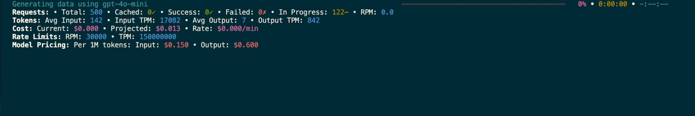

<p align="center">
  <a href="https://bespokelabs.ai/" target="_blank">
    <picture>
      <source media="(prefers-color-scheme: light)" width="100px" srcset="docs/Bespoke-Labs-Logomark-Red-crop.png">
      
    </picture>
  </a>
</p>

<h1 align="center">Bespoke Curator</h1>
<h3 align="center" style="font-size: 20px; margin-bottom: 4px">用于后训练和结构化数据提取的数据管理工具</h3>
<br/>
<p align="center">
  <a href="https://docs.bespokelabs.ai/">
    
  </a>
  <a href="https://bespokelabs.ai/">
    
  </a>
  
  <a href="https://twitter.com/bespokelabsai">
    
  </a>
  <a href="https://discord.gg/KqpXvpzVBS">
    
  </a>
</p>
<div align="center">
[ <a href="README.md">English</a> | 中文 ]
</div>

## 概述

Bespoke Curator 让创建合成数据流程变得简单。无论您是在训练模型还是提取结构化数据，Curator 都能快速且稳健地准备高质量数据。

* 丰富的 Python 库，用于生成和管理合成数据
* 交互式查看器，用于监控数据生成过程
* 对结构化输出的一流支持
* 内置性能优化，支持异步操作、缓存和各种规模的故障恢复
* 通过 LiteLLM、vLLM 和流行的批处理 API 支持广泛的推理选项



> [!提示]
> 查看我们在 [docs.bespokelabs.ai](https://docs.bespokelabs.ai) 的完整文档，包括[入门指南](https://docs.bespokelabs.ai/bespoke-curator/getting-started)、[教程](https://docs.bespokelabs.ai/bespoke-curator/tutorials)、[使用指南](https://docs.bespokelabs.ai/bespoke-curator/how-to-guides)和详细的[参考文档](https://docs.bespokelabs.ai/bespoke-curator/api-reference/llm-api-documentation)。


## 安装

```bash
pip install bespokelabs-curator
```

## 快速入门

### 使用 `curator.LLM`

```python
from bespokelabs import curator
llm = curator.LLM(model_name="gpt-4o-mini")
poem = llm("写一首关于 AI 中数据重要性的诗。")
print(poem['response'])
```

> [!注意]
> 默认启用重试和缓存功能，以帮助您快速迭代数据流程。
> 因此，如果您再次运行相同的提示，您将几乎立即获得相同的响应。
> 您可以删除 `~/.cache/curator` 中的缓存，或通过设置 `export CURATOR_DISABLE_CACHE=true` 禁用它。

### 调用其他模型
您也可以通过更改 `model_name` 参数来调用其他 [LiteLLM](https://docs.litellm.ai/docs/) 支持的模型。

```python
llm = curator.LLM(model_name="claude-3-5-sonnet-20240620")
```

除了广泛的 API 提供商外，LiteLLM 还支持本地网络服务器（由 vLLM 或 Ollama 托管）。对于通过 vLLM 进行完全离线推理，请参阅[本地模型](docs/local_models.md)文档。

> [!提示]
> 确保将您调用的模型的 API 密钥设置为环境变量。例如，运行 `export OPENAI_API_KEY=sk-...` 和 `export ANTHROPIC_API_KEY=ant-...` 将允许您运行前面的两个示例。支持的模型及其相关环境变量名称的完整列表可以在 [litellm 文档](https://docs.litellm.ai/docs/providers)中找到。

### 使用结构化输出

让我们使用结构化输出在单个 LLM 调用中生成多首诗。我们可以定义一个类来封装诗歌列表，然后将其传递给 `LLM` 类。

```python
from typing import List
from pydantic import BaseModel, Field
from bespokelabs import curator

class Poem(BaseModel):
    poem: str = Field(description="一首诗。")


class Poems(BaseModel):
    poems_list: List[Poem] = Field(description="诗歌列表。")


llm = curator.LLM(model_name="gpt-4o-mini", response_format=Poems)
poems = llm(["写两首关于 AI 中数据重要性的诗。", 
            "写三首关于 AI 中数据重要性的俳句。"])
print(poems['responses'])
```

注意每个 `Poems` 对象在数据集中占据一行。

对于更高级的用例，您可能需要定义更多自定义解析和提示逻辑。例如，您可能想要保留每个主题与从中生成的诗之间的映射关系。在这种情况下，您可以定义一个继承自 `LLM` 的 `Poet` 对象，并定义您自己的提示和解析逻辑：

```python
from typing import Dict, List
from datasets import Dataset
from pydantic import BaseModel, Field
from bespokelabs import curator


class Poem(BaseModel):
    poem: str = Field(description="一首诗。")


class Poems(BaseModel):
    poems: List[Poem] = Field(description="诗歌列表。")


class Poet(curator.LLM):
    response_format = Poems

    def prompt(self, input: Dict) -> str:
        return f"写两首关于{input['topic']}的诗。"

    def parse(self, input: Dict, response: Poems) -> Dict:
        return [{"topic": input["topic"], "poem": p.poem} for p in response.poems]


poet = Poet(model_name="gpt-4o-mini")

topics = Dataset.from_dict({"topic": ["繁华都市中的都市孤独", "Bespoke Labs 的 Curator 库的美"]})
poem = poet(topics)
print(poem.to_pandas())
```
```
                                      topic                                               poem
0                       繁华都市中的都市孤独  在城市的心脏，灯光永不熄灭...
1                       繁华都市中的都市孤独  脚步声回荡，雨后的人行道闪烁...
2           Bespoke Labs 的 Curator 库的美  在管理的领域中，\n艺术与技术相遇...
3           Bespoke Labs 的 Curator 库的美  走进库的怀抱，\n一个神圣的空间...
```

在 `Poet` 类中：
* `response_format` 是我们上面定义的结构化输出类。
* `prompt` 接收输入（`input`）并返回给 LLM 的提示。
* `parse` 接收输入（`input`）和结构化输出（`response`）并将其转换为字典列表。这样我们就可以轻松地将输出转换为 HuggingFace Dataset 对象。

注意，`topics` 也可以通过另一个 `LLM` 类创建，我们可以扩展这个过程来创建成千上万的不同诗歌。您可以在 [examples/poem-generation/poem.py](examples/poem-generation/poem.py) 文件中看到更详细的示例，以及在 [examples](examples) 目录中查看其他示例。

更多详细信息以及故障排除信息，请参阅[文档](https://docs.bespokelabs.ai/)。

## Bespoke Curator 查看器


要运行 bespoke 数据集查看器：

```bash
curator-viewer
```

如果您没有指定不同的主机和端口，这将在默认情况下在 `127.0.0.1:3000` 上打开一个带有查看器的浏览器窗口。

数据集查看器显示您进行的所有不同运行。选择运行后，您可以查看数据集和来自 LLM 的响应。

在不同主机和端口上运行查看器的可选参数：
```bash
>>> curator-viewer -h
usage: curator-viewer [-h] [--host HOST] [--port PORT] [--verbose]

Curator 查看器

options:
  -h, --help     显示此帮助消息并退出
  --host HOST    运行服务器的主机（默认：localhost）
  --port PORT    运行服务器的端口（默认：3000）
  --verbose, -v  启用调试日志以获得更详细的输出
```

运行 `curator-viewer` 的唯一要求是安装 node。您可以按照[这里](https://nodejs.org/en/download/package-manager)的说明安装它们。

例如，要检查是否已安装 node，您可以运行：

```bash
node -v
```

如果未安装，在 MacOS 上安装最新的 node，您可以运行：

```bash
# 安装 nvm（Node 版本管理器）
curl -o- https://raw.githubusercontent.com/nvm-sh/nvm/v0.40.0/install.sh | bash
# 下载并安装 Node.js（可能需要重启终端）
nvm install 22
# 验证环境中是否有正确的 Node.js 版本
node -v # 应该显示 `v22.11.0`
# 验证环境中是否有正确的 npm 版本
npm -v # 应该显示 `10.9.0`
```

## 贡献
感谢所有为这个项目做出贡献的贡献者！
请按照[这些说明](CONTRIBUTING.md)了解如何贡献。

## 引用
如果您觉得 Curator 有用，请考虑引用我们！

```
@software{Curator: A Tool for Synthetic Data Creation,
  author = {Marten, Ryan and Vu, Trung and Cheng-Jie Ji, Charlie and Sharma, Kartik and Dimakis, Alex and Sathiamoorthy, Mahesh},
  month = jan,
  title = {{Curator}},
  year = {2025}
}
```